# Context‑Aware Chat — Visual Guide

This guide shows how NubiqAI builds rich context (like Copilot summaries) for every message: rolling summary + key facts, user profile, recent turns, and long‑term memories.

> Where to look in the code
>
> - Prompt orchestration: `Server/index.ts`
> - Rolling summary: `Server/services/contextManager.ts`
> - Memory system: `Server/services/hybridMemoryService.ts`
> - Conversation/session store: `Server/services/conversationService.ts`
> - Frontend routing: `src/components/ChatInterface.tsx`

---

## Architecture at a glance

```mermaid
flowchart TD
  U[User Input] --> R[Request Orchestrator\nServer/index.ts]
  R --> RS[Rolling Summary\ncontextManager.buildRollingSummary]
  R --> MEM[Hybrid Memory Search\nlocal + Pinecone]
  MEM -->|Local turns| L(Local)
  MEM -->|Summaries| S(Summaries)
  MEM -->|Long‑term| LT(Long‑term)
  R --> PF[User Profile Context]
  RS --> PB
  L --> PB
  S --> PB
  LT --> PB
  PF --> PB
  PB[Prompt Builder] --> AI[Model\nTEXT_MODEL or IMAGE_MODEL]
  AI --> RES[Response]
  RES --> PERSIST[Background Persist\nconversationService + Firebase + Pinecone]
```



Place for a diagram image (optional):


---

## Request lifecycle (sequence)

```mermaid
sequenceDiagram
  autonumber
  participant FE as Frontend (ChatInterface)
  participant API as Server /api/ask-ai
  participant Ctx as contextManager
  participant Mem as hybridMemoryService
  participant Prof as userProfileService
  participant LLM as Model

  FE->>API: message + chatId + history + summary hints
  API->>Ctx: buildRollingSummary(userId, chatId)
  Ctx-->>API: summary + keyFacts
  API->>Mem: searchMemory(userId, query, chatId)
  Mem-->>API: combinedContext (local, summaries, long‑term)
  API->>Prof: generateProfileContext(userId)
  Prof-->>API: profile text
  API->>LLM: Prompt(summary + facts + profile + memory + user msg)
  LLM-->>API: text or image parts
  API-->>FE: response (text/image) sent immediately
  API->>PERSIST: store turn + optional image (background)
```



Place for a timeline image (optional):


---

## Strategy: how we choose context (cost‑aware)


> Hints
>
> - Skipping Pinecone when local results suffice saves latency and cost.
> - Chat‑scoped long‑term search improves relevance for ongoing threads.

---

## Rolling summary + key facts

- Goal: give the model a compact, actionable snapshot first.
- Source: last 10–12 turns (prefer same chat) + user profile context.
- Output (JSON only):

```json
{
  "summary": "4–8 sentence narrative of goals, decisions, and ongoing tasks.",
  "keyFacts": [
    "short, durable fact or constraint",
    "preference or identifier",
    "next step or pending decision"
  ]
}
```

Place for an illustration (optional):


---

## Prompt assembly snapshot

The prompt places high‑signal context first, then history:

```text
SYSTEM: You are NubiqAI …

==============================
🧾 ROLLING SUMMARY
<summary text…>

KEY FACTS:
• fact 1
• fact 2
• fact 3

==============================
🧠 CONVERSATION HISTORY & USER PROFILE:
<combinedContext from memory service…>

==============================
💬 CURRENT USER QUESTION:
<prompt>
```

---

## Configuration

- `TEXT_MODEL` — used for chat and summarization
- `IMAGE_MODEL` — used for image generation
- `CONTEXT_SUMMARY_BUDGET_TOKENS` — cap summary size (default 800)
- Intent switches: `INTENT_CLASSIFIER`, `AUTO_GENERATE_INTENT`

---

## Frontend hooks (images)

- Natural language image detection (supports noun‑first like “image of …”).
- `/imagine` command supported.
- IndexedDB caches image data for instant reloads.

Place for a UI mock (optional):


---

## Extending this design

- Persist rolling summary per chat and update incrementally after each turn.
- Track decisions/TODOs/blockers as first‑class memory and surface them.
- Add a budget allocator to always fit the model context window.
- Add a fallback model chain for summarization.

---

## Image placeholders

Create `./assets/` and add:
- `context-architecture.png`
- `request-lifecycle.png`
- `rolling-summary.png`
- `chat-ui.png`

They’ll render automatically in this doc once added.
