# The Two-Tier Memory System: A Visual Guide

This document provides a visual explanation of how the application's memory system works. It combines a fast, local (short-term) memory with a powerful, persistent Pinecone (long-term) memory to provide context that is relevant, fast, and cost-effective.

---

## 1. The Two Tiers of Memory

The system is built on two distinct layers of memory:

| Feature          | Tier 1: Local Memory                               | Tier 2: Pinecone Long-Term Memory                  |
| ---------------- | -------------------------------------------------- | -------------------------------------------------- |
| **Speed**        | ⚡️ Instant (RAM access)                            | ☁️ Fast (Cloud query, but slower than RAM)         |
| **Persistence**  | 🗑️ Temporary (Lost when server restarts)           | 💾 Permanent (Stored in Pinecone database)         |
| **Cost**         | ✅ Free (Uses server's RAM)                        | 💰 Incurs cost (API calls and storage)             |
| **Use Case**     | Remembering the last few things you said.          | Recalling key facts from weeks or months ago.      |
| **Scope**        | Usually focused on the current chat session.       | Can search across all your past conversations.     |

---

## 2. The Memory Search Flowchart (How the AI Remembers)

When you send a message, the system follows this intelligent process to gather context before generating a response.

```mermaid
graph TD;
    A[User Sends a New Message] --> B{Search Local Memory};
    B --> C{Is local context sufficient?};
    
    C -- Yes --> D[💰 Cost-Saving: Skip Pinecone Search];
    D --> G[Combine Local Context + User Profile];
    
    C -- No --> E{Is this a new chat?};
    E -- Yes --> F_ALL[☁️ Search ALL past chats in Pinecone];
    E -- No --> F_SCOPED[🎯 Search ONLY the current chat in Pinecone];
    
    subgraph "Gather All Context"
        direction LR
        F_ALL --> G;
        F_SCOPED --> G;
    end
    
    G --> H[🤖 Send Combined Context to AI Model];
    H --> I[AI Generates Response];

    style D fill:#d4edda,stroke:#c3e6cb
```

**Key Takeaways:**

1. **Local First:** The system always checks the fast, free local memory first.
2. **Smart Skip:** It intelligently decides whether to query the expensive Pinecone memory, saving costs on simple follow-ups.
3. **Scoped Search:** When it does search Pinecone, it narrows the search to the current chat if possible, making it faster and more relevant.

---

## 3. The Memory Persistence Flowchart (How Memories are Saved)

Conversations are saved to the long-term Pinecone memory based on specific triggers and a cooldown system to prevent spamming the database.

```mermaid
graph TD;
    A[User switches chats, signs out, or after a period of inactivity] --> B{Is the 1-minute cooldown active for this chat?};
    
    B -- Yes --> C[⏸️ Wait. The chat will be saved later.];
    
    B -- No --> D[✅ Cooldown clear. Start persistence.];
    D --> E[1. Get all new conversation turns for the chat];
    E --> F[2. Convert each turn into a vector embedding];
    F --> G[3. ☁️ Store the new embeddings in Pinecone];
    G --> H[4. Reset the cooldown timer for this chat];

    style C fill:#fff3cd,stroke:#ffeeba
    style G fill:#d1ecf1,stroke:#bee5eb
```

**Key Takeaways:**
1.  **Not Instant:** Memories are not saved to Pinecone after every single message.
2.  **Cooldown:** A 1-minute cooldown prevents the system from making too many requests, which saves money.
3.  **Batching:** The system is designed to save chunks of conversation at once, which is more efficient.

This hybrid approach ensures the AI has a robust and intelligent memory, providing a seamless and context-aware conversational experience.
