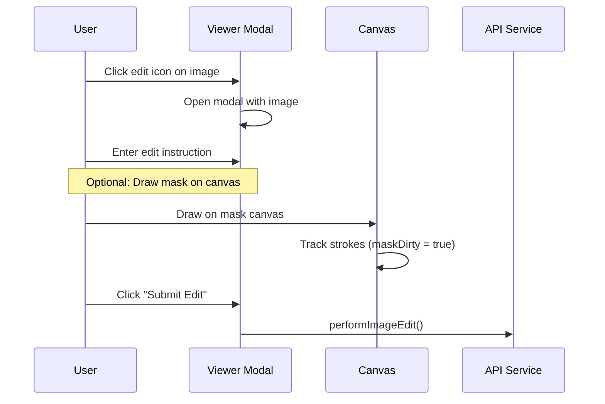
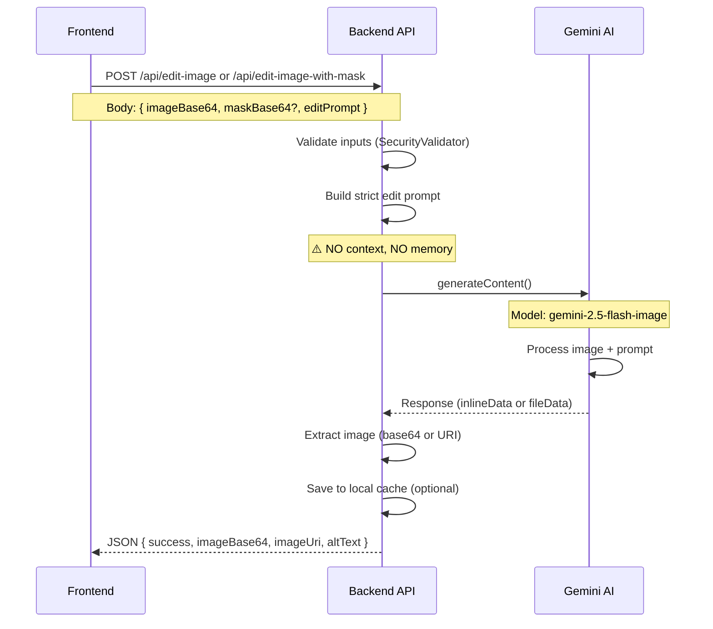

# 🎨 Image Editing Visual Guide

## Overview

NubiqAI's image editing system uses Google Gemini's vision and image generation models to modify images based on user instructions. The system supports two editing modes: **simple editing** and **mask-based editing** with context-free prompts to ensure precise, minimal changes.

---

## 🏗️ Architecture Diagram

```
┌─────────────────────────────────────────────────────────────────┐
│                         USER INTERFACE                          │
│                    (ChatInterface.tsx)                          │
└─────────────────────────────────────────────────────────────────┘
                            │
                            │ 1. User clicks edit icon
                            ▼
┌─────────────────────────────────────────────────────────────────┐
│                    IMAGE VIEWER MODAL                           │
│  ┌───────────────────────────────────────────────────────┐     │
│  │  • Image Display                                      │     │
│  │  • Edit Prompt Input Field                            │     │
│  │  • Drawing Canvas (for mask)                          │     │
│  │  • Brush Size Controls                                │     │
│  │  • Undo/Clear Mask Buttons                            │     │
│  │  • Submit Edit Button                                 │     │
│  └───────────────────────────────────────────────────────┘     │
└─────────────────────────────────────────────────────────────────┘
                            │
                            │ 2. User enters edit instruction
                            │    + optionally draws mask
                            ▼
┌─────────────────────────────────────────────────────────────────┐
│              performImageEdit() Function                        │
│  ┌───────────────────────────────────────────────────────┐     │
│  │  1. Convert image to base64                           │     │
│  │  2. Generate mask from canvas (if drawn)              │     │
│  │  3. Create placeholder message "__editing_image__"    │     │
│  │  4. Call API (with mask or without)                   │     │
│  └───────────────────────────────────────────────────────┘     │
└─────────────────────────────────────────────────────────────────┘
                            │
            ┌───────────────┴───────────────┐
            │                               │
            ▼                               ▼
┌──────────────────────────┐    ┌──────────────────────────┐
│  /api/edit-image         │    │ /api/edit-image-with-mask│
│  (Simple Edit)           │    │ (Mask-based Edit)        │
└──────────────────────────┘    └──────────────────────────┘
            │                               │
            └───────────────┬───────────────┘
                            │
                            ▼
┌─────────────────────────────────────────────────────────────────┐
│              BACKEND PROCESSING (Server/index.ts)               │
│                                                                 │
│  ┌─────────────────────────────────────────────────────┐       │
│  │  Step 1: Validate Input                             │       │
│  │   • Check editPrompt (SecurityValidator)            │       │
│  │   • Check imageBase64 (max 10MB)                    │       │
│  │   • Check maskBase64 (if provided)                  │       │
│  └─────────────────────────────────────────────────────┘       │
│                            │                                    │
│                            ▼                                    │
│  ┌─────────────────────────────────────────────────────┐       │
│  │  Step 2: Build Context-Free Edit Prompt             │       │
│  │   ⚠️ CRITICAL: NO conversation context              │       │
│  │   ⚠️ CRITICAL: NO memory injection                  │       │
│  │   ⚠️ CRITICAL: ONLY edit instruction + image        │       │
│  └─────────────────────────────────────────────────────┘       │
│                            │                                    │
│                            ▼                                    │
│  ┌─────────────────────────────────────────────────────┐       │
│  │  Step 3: Generate Content with Gemini               │       │
│  │   Model: gemini-2.5-flash-image                     │       │
│  │   Input: Image (inlineData) + Strict Edit Prompt    │       │
│  └─────────────────────────────────────────────────────┘       │
│                            │                                    │
│                            ▼                                    │
│  ┌─────────────────────────────────────────────────────┐       │
│  │  Step 4: Extract Response                            │       │
│  │   • Extract base64 from inlineData                   │       │
│  │   • OR extract URI from fileData                     │       │
│  │   • OR extract URL from text (fallback)              │       │
│  │   • Extract altText description                      │       │
│  └─────────────────────────────────────────────────────┘       │
│                            │                                    │
│                            ▼                                    │
│  ┌─────────────────────────────────────────────────────┐       │
│  │  Step 5: Cache Image Locally (Optional)             │       │
│  │   Service: localImageCacheService                    │       │
│  │   Path: Server/local-images/                         │       │
│  └─────────────────────────────────────────────────────┘       │
└─────────────────────────────────────────────────────────────────┘
                            │
                            │ Response JSON
                            ▼
┌─────────────────────────────────────────────────────────────────┐
│                    FRONTEND RESPONSE HANDLER                    │
│  ┌───────────────────────────────────────────────────────┐     │
│  │  1. Remove "__editing_image__" placeholder            │     │
│  │  2. Create new message with edited image              │     │
│  │  3. Update viewer with new image                      │     │
│  │  4. Store in IndexedDB (imageStorageService)          │     │
│  │  5. Upload to Firebase Storage (async)                │     │
│  └───────────────────────────────────────────────────────┘     │
└─────────────────────────────────────────────────────────────────┘
```

---

## 🔄 Image Editing Flow (Step-by-Step)

### Phase 1: User Initiation



### Phase 2: Data Preparation

```typescript
// ChatInterface.tsx - performImageEdit() function

// 1. Convert image to base64
let imageBase64 = '';
if (viewerSrc.startsWith('data:')) {
  imageBase64 = viewerSrc.split(',')[1];
} else {
  // Fetch from URL and convert
  const r = await fetch(viewerSrc);
  const blob = await r.blob();
  // ... convert blob to base64
}

// 2. Generate mask from canvas (if user drew on it)
let maskBase64: string | null = null;
if (maskDirty && maskCanvasRef.current) {
  const canvas = maskCanvasRef.current;
  const tmp = document.createElement('canvas');
  const tctx = tmp.getContext('2d')!;
  
  // Convert drawn strokes to binary mask (white = edit area)
  // ... process canvas pixels
  
  maskBase64 = tmp.toDataURL('image/png').split(',')[1];
}

// 3. Create placeholder message
const placeholderMsg: Message = {
  id: `edit-${Date.now()}`,
  content: editPrompt,
  role: 'assistant',
  timestamp: new Date(),
  attachments: ['__editing_image__'] // Visual indicator
};
```

### Phase 3: API Call



### Phase 4: Response Processing

```typescript
// Backend (Server/index.ts) - Edit response processing

// Extract image from Gemini response
const parts: any[] = (response as any)?.parts ?? [];
let editedBase64: string | null = null;
let editedUri: string | null = null;
let altText: string | null = null;

for (const part of parts) {
  if (part.inlineData) {
    editedBase64 = part.inlineData.data;
  }
  if (part.fileData) {
    editedUri = part.fileData.fileUri;
  }
  if (part.text) {
    altText = part.text;
  }
}

// Fallback: Extract URL from text response
if (!editedBase64 && !editedUri && altText) {
  const extracted = extractImageUrlFromText(altText);
  if (extracted) {
    // Download and convert to base64
    const resp = await fetch(extracted);
    const buffer = Buffer.from(await resp.arrayBuffer());
    editedBase64 = buffer.toString('base64');
  }
}

// Cache locally for instant future loads
if (localImageCacheService.isEnabled()) {
  const saved = await localImageCacheService.saveBase64(
    userId || 'anonymous',
    'edit',
    editedBase64,
    'png'
  );
  imageLocalUri = saved.localUri;
}

// Return to frontend
res.json({
  success: true,
  imageBase64: editedBase64,
  imageUri: editedUri,
  imageLocalUri,
  altText
});
```

### Phase 5: Frontend Update

```typescript
// Frontend receives response and updates UI

if (editResp.success && (editResp.imageBase64 || editResp.imageUri)) {
  const newUrl = editResp.imageBase64 
    ? `data:image/png;base64,${editResp.imageBase64}` 
    : editResp.imageUri!;

  // Remove placeholder message
  const filtered = activeChat.messages.filter(
    m => !(m.attachments?.includes('__editing_image__'))
  );

  // Add new message with edited image
  const newMsg: Message = {
    id: (Date.now() + 1).toString(),
    content: editPrompt, // Original user prompt
    role: 'assistant',
    timestamp: new Date(),
    attachments: [newUrl],
    metadata: { altText: editResp.altText }
  };

  onUpdateChat({ 
    ...activeChat, 
    messages: [...filtered, newMsg] 
  });

  // Update viewer
  setViewerSrc(newUrl);
  setEditPrompt(''); // Clear for next edit
  toast.success('Image edited');
}
```

---

## 🎯 Context-Free Edit Prompt (CRITICAL!)

The backend uses a **strict, context-free prompt** to ensure the AI ONLY edits what's requested:

```typescript
// Server/index.ts - Edit instruction template

const editInstruction = `You are an expert image editor. Your task is to edit this image PRECISELY as requested.

USER REQUEST: ${prompt}

STRICT RULES:
1. Make ONLY the specific changes requested by the user
2. Preserve everything else EXACTLY as it appears in the original image
3. Maintain the original image composition, lighting, style, and quality
4. Do NOT add creative interpretations or extra elements
5. Do NOT change the background, lighting, or overall scene unless explicitly requested
6. Return a single edited image that looks natural and seamless

Focus: Minimal, precise edits. Maximum preservation of the original image.`;
```

### Why Context-Free?

❌ **BAD**: Including conversation context
```typescript
// This would bleed context into the edit
const badPrompt = `
Previous conversation:
User: I like cats
Assistant: That's great!

Now edit this image: ${editPrompt}
`; // AI might add cats unnecessarily!
```

✅ **GOOD**: Clean, focused edit instruction
```typescript
// This ensures precise editing
const goodPrompt = `Edit this image: ${editPrompt}
Preserve everything else.`;
```

---

## 🎨 Two Editing Modes

### Mode 1: Simple Edit (No Mask)

**Endpoint**: `/api/edit-image`

**Use Case**: General edits without specific area targeting

```
User: "Make the sky more blue"

┌─────────────────┐
│                 │
│   Original      │  →  Gemini processes  →  ┌─────────────────┐
│   Image         │     entire image          │   Edited        │
│                 │                           │   Image         │
│   🏠 🌤️         │                           │   🏠 🔵         │
└─────────────────┘                           └─────────────────┘
```

**Backend Flow**:
```typescript
// ✅ IMPROVED: Send actual image pixels (not text description)
const response = await generateContent({
  model: 'gemini-2.5-flash-image',
  contents: [{
    parts: [
      {
        inlineData: {
          data: imageBase64,
          mimeType: 'image/png'
        }
      },
      { text: editInstruction }
    ]
  }]
});

// ❌ OLD APPROACH (causes quality degradation):
// Step 1: Describe image → text
// Step 2: Generate from text → loses fidelity
```

### Mode 2: Mask-Based Edit

**Endpoint**: `/api/edit-image-with-mask`

**Use Case**: Precise edits to specific regions

```
User: "Change the car color to red"
User draws mask over car area

┌─────────────────┐     ┌─────────────────┐
│                 │     │                 │
│   Original      │     │   Mask          │
│   Image         │  +  │   (white=edit)  │
│                 │     │                 │
│   🏠 🚗 🌳      │     │   ⬜⬜⬛        │
└─────────────────┘     └─────────────────┘
                            │
                            ▼
                    ┌─────────────────┐
                    │   Edited        │
                    │   Image         │
                    │                 │
                    │   🏠 🚗🔴 🌳   │
                    └─────────────────┘
```

**Backend Flow** (Mask Mode):
```typescript
// ✅ IMPROVED: Send both actual images to preserve fidelity
const imageModel = 'gemini-2.5-flash-image';

const editInstruction = `You are an expert image editor.

MASK: A second image shows the areas to edit (white/colored regions). Focus ONLY on those areas.

USER REQUEST: ${editPrompt}

STRICT RULES:
1. Make ONLY the specific changes in the masked areas
2. Preserve everything else EXACTLY as it appears
3. Blend edits seamlessly with the rest of the image

Focus: Minimal, precise edits to masked areas only.`;

const response = await generateContent({
  model: imageModel,
  contents: [{
    parts: [
      { inlineData: { data: imageBase64, mimeType: 'image/png' } },
      { inlineData: { data: maskBase64, mimeType: 'image/png' } },
      { text: editInstruction }
    ]
  }]
});

// ❌ OLD APPROACH (caused severe quality degradation after 3-4 edits):
// Step 1: Describe original image → text description
// Step 2: Describe mask area → text description  
// Step 3: Generate from text descriptions → loses fidelity
// Problem: Each edit iteration would describe-then-generate, compounding error
```

---

## 🖌️ Mask Canvas Drawing

The frontend provides a transparent canvas overlay for users to draw edit regions:

```typescript
// Drawing logic in ChatInterface.tsx

const startDrawing = (e: React.MouseEvent<HTMLCanvasElement>) => {
  if (!maskCanvasRef.current) return;
  setIsDrawing(true);
  setMaskDirty(true); // Mark mask as modified
  
  const canvas = maskCanvasRef.current;
  const ctx = canvas.getContext('2d')!;
  const rect = canvas.getBoundingClientRect();
  const x = e.clientX - rect.left;
  const y = e.clientY - rect.top;
  
  ctx.beginPath();
  ctx.moveTo(x, y);
};

const draw = (e: React.MouseEvent<HTMLCanvasElement>) => {
  if (!isDrawing || !maskCanvasRef.current) return;
  
  const canvas = maskCanvasRef.current;
  const ctx = canvas.getContext('2d')!;
  const rect = canvas.getBoundingClientRect();
  const x = e.clientX - rect.left;
  const y = e.clientY - rect.top;
  
  ctx.lineWidth = brushSize;
  ctx.lineCap = 'round';
  ctx.strokeStyle = 'rgba(255, 0, 0, 0.5)'; // Semi-transparent red
  ctx.lineTo(x, y);
  ctx.stroke();
};

// Convert drawn canvas to binary mask (white = edit area, black = preserve)
const generateMask = (canvas: HTMLCanvasElement): string => {
  const tmp = document.createElement('canvas');
  tmp.width = canvas.width;
  tmp.height = canvas.height;
  const tctx = tmp.getContext('2d')!;
  
  const sctx = canvas.getContext('2d')!;
  const src = sctx.getImageData(0, 0, canvas.width, canvas.height);
  const out = tctx.createImageData(canvas.width, canvas.height);
  
  // Convert any drawn pixel to white (255), untouched to black (0)
  for (let i = 0; i < src.data.length; i += 4) {
    const alpha = src.data[i + 3];
    const painted = alpha > 10; // Threshold for "drawn"
    
    if (painted) {
      out.data[i] = 255;     // R
      out.data[i+1] = 255;   // G
      out.data[i+2] = 255;   // B
      out.data[i+3] = 255;   // A
    } else {
      out.data[i] = 0;       // Black = preserve
      out.data[i+1] = 0;
      out.data[i+2] = 0;
      out.data[i+3] = 0;
    }
  }
  
  tctx.putImageData(out, 0, 0);
  return tmp.toDataURL('image/png');
};
```

---

## 🔒 Security & Validation

### Input Validation

```typescript
// Server/index.ts - SecurityValidator checks

// 1. Validate edit prompt
if (!editPrompt || typeof editPrompt !== 'string' || 
    !SecurityValidator.validatePrompt(editPrompt)) {
  logSecurityEvent('Invalid image edit prompt', { userId });
  return res.status(400).json({ error: 'Invalid or missing editPrompt' });
}

// 2. Validate image base64 (max 10MB)
if (!imageBase64 || typeof imageBase64 !== 'string' || 
    !SecurityValidator.validateBase64Image(imageBase64)) {
  logSecurityEvent('Invalid image in edit-image', { userId });
  return res.status(400).json({ 
    error: 'Invalid or oversized imageBase64 (max 10MB)' 
  });
}

// 3. Validate mask (if provided)
if (maskBase64 && (!SecurityValidator.validateBase64Image(maskBase64))) {
  logSecurityEvent('Invalid mask in edit-image-with-mask', { userId });
  return res.status(400).json({ 
    error: 'Invalid or oversized maskBase64 (max 10MB)' 
  });
}

// 4. Validate userId format
if (userId && !SecurityValidator.validateUserId(userId)) {
  logSecurityEvent('Invalid userId in edit-image', { userId });
  return res.status(400).json({ error: 'Invalid user ID format' });
}
```

### Rate Limiting

```typescript
// Image editing uses "image" rate limit tier
app.post('/api/edit-image', 
  rateLimitMiddleware('image'), // 100 requests per 15 minutes
  async (req, res) => { /* ... */ }
);
```

---

## 💾 Image Storage Pipeline

### Storage Tiers

```
┌──────────────────────────────────────────────────────┐
│                    CLIENT SIDE                       │
├──────────────────────────────────────────────────────┤
│  1. In-Memory State (React state)                    │
│     - Temporary during editing session               │
│     - viewerSrc, editPrompt, maskFile                │
│                                                      │
│  2. IndexedDB (imageStorageService)                  │
│     - 50MB limit per domain                          │
│     - Fast local access                              │
│     - Survives page refresh                          │
│                                                      │
│  3. Firebase Storage (async upload)                  │
│     - Permanent cloud storage                        │
│     - URL references stored in localStorage          │
└──────────────────────────────────────────────────────┘

┌──────────────────────────────────────────────────────┐
│                    SERVER SIDE                       │
├──────────────────────────────────────────────────────┤
│  4. Local Server Cache (localImageCacheService)      │
│     - Server/local-images/                           │
│     - Fast serving for recent edits                  │
│     - Time-based eviction (optional)                 │
└──────────────────────────────────────────────────────┘
```

### Storage Flow

```typescript
// Frontend storage after successful edit

// 1. Update chat state (in-memory)
const newMsg: Message = {
  id: Date.now().toString(),
  content: editPrompt,
  role: 'assistant',
  timestamp: new Date(),
  attachments: [newImageUrl],
  metadata: { altText }
};

// 2. Store in IndexedDB for fast local access
await imageStorageService.saveImage(
  newMsg.id, 
  newImageUrl
);

// 3. Upload to Firebase Storage (async, non-blocking)
try {
  const firebaseUrl = await uploadImageToFirebase(
    newImageUrl,
    `edits/${user.id}/${Date.now()}.png`
  );
  
  // Replace local URL with Firebase URL in message
  newMsg.attachments = [firebaseUrl];
} catch (err) {
  console.warn('Firebase upload failed, using local URL', err);
}

// 4. Persist chat to Firestore
await apiService.updateChat({
  userId: user.id,
  chatId: activeChat.id,
  messages: [...activeChat.messages, newMsg]
});
```

---

## 🛑 Cancellation & Error Handling

### Abort Controller Pattern

```typescript
// User can cancel mid-edit by clicking stop button

const performImageEdit = async () => {
  // Create new AbortController for this request
  const controller = new AbortController();
  abortControllerRef.current = controller;
  (controller as any).isImageEdit = true; // Flag for cleanup
  const signal = controller.signal;

  try {
    // Pass signal to API call
    const editResp = await apiService.editImage({ 
      imageBase64, 
      editPrompt, 
      signal 
    });
    // ... process response
  } catch (err) {
    if (err.name === 'AbortError') {
      // User cancelled - cleanup handled by handleStopGeneration
      return;
    }
    // Other errors
    toast.error(`Edit failed: ${err.message}`);
  } finally {
    setIsEditing(false);
    setIsLoading(false);
    abortControllerRef.current = null;
  }
};

// Stop button handler
const handleStopGeneration = () => {
  if (!abortControllerRef.current) return;
  
  const wasImageEdit = (abortControllerRef.current as any).isImageEdit;
  
  // Cancel the request
  abortControllerRef.current.abort();
  
  // Remove placeholder message
  onUpdateChat({
    ...activeChat,
    messages: activeChat.messages.filter(
      m => !m.attachments?.includes('__editing_image__')
    )
  });
  
  // If image edit, reopen viewer
  if (wasImageEdit) {
    setIsEditing(false);
    setViewerOpen(true);
  }
  
  toast.info('Editing cancelled');
};
```

### Error States

| Error Type | Cause | Handling |
|------------|-------|----------|
| `AbortError` | User cancelled | Silent cleanup, show info toast |
| `400 Bad Request` | Invalid prompt/image | Show validation error |
| `413 Payload Too Large` | Image > 10MB | Show size limit error |
| `429 Too Many Requests` | Rate limit exceeded | Show rate limit message + retry time |
| `500 Server Error` | Gemini API failure | Show generic error + retry option |
| Network timeout | Connection lost | Show timeout error + retry |

---

## 📊 Performance Metrics

### Image Edit Latency Breakdown

```
┌─────────────────────────────────────────────────────┐
│  Frontend Prep:           ~200ms                    │
│   - Canvas to base64                                │
│   - Create placeholder                              │
├─────────────────────────────────────────────────────┤
│  Network Transfer:        ~500ms                    │
│   - Upload image + prompt                           │
├─────────────────────────────────────────────────────┤
│  Backend Processing:      ~3-7 seconds              │
│   - Gemini API call (majority of time)              │
│   - Image extraction & caching                      │
├─────────────────────────────────────────────────────┤
│  Response Transfer:       ~800ms                    │
│   - Download edited image                           │
├─────────────────────────────────────────────────────┤
│  Frontend Update:         ~100ms                    │
│   - Update UI, store in IndexedDB                   │
├─────────────────────────────────────────────────────┤
│  TOTAL:                   ~5-9 seconds              │
└─────────────────────────────────────────────────────┘
```

### Optimization Opportunities

✅ **Already Implemented**:
- Local server cache for instant re-serving
- IndexedDB for client-side caching
- Base64 extraction from multiple response formats
- Abort controller for cancellation

🔮 **Future Optimizations**:
- Progressive image loading (show low-res preview first)
- Batch edit queue (edit multiple images sequentially)
- WebSocket streaming for real-time progress updates
- CDN integration for Firebase Storage URLs

---

## 🧪 Testing Checklist

### Manual Test Cases

- [ ] **Simple edit**: "Make the image brighter"
  - ✅ Image becomes brighter
  - ✅ No other changes to composition
  
- [ ] **Color change**: "Change the car to blue"
  - ✅ Only car color changes
  - ✅ Background preserved
  
- [ ] **Object removal**: "Remove the person"
  - ✅ Person removed cleanly
  - ✅ Background filled naturally
  
- [ ] **Mask-based edit**: Draw mask over object + "Make it red"
  - ✅ Only masked area changes
  - ✅ Rest of image untouched
  
- [ ] **Error handling**: Upload 15MB image
  - ✅ Error message shown
  - ✅ UI remains functional
  
- [ ] **Cancellation**: Start edit → click stop
  - ✅ Request aborted
  - ✅ Placeholder removed
  - ✅ Viewer reopens
  
- [ ] **Multi-edit**: Edit → edit again → edit again
  - ✅ Each edit uses previous result
  - ✅ No memory leaks
  - ✅ Canvas resets properly

---

## 🔧 Troubleshooting

### Common Issues

**Issue**: "Image edit failed: Invalid base64"
```typescript
// Solution: Check image size before sending
const MAX_SIZE = 10 * 1024 * 1024; // 10MB
if (imageBase64.length * 0.75 > MAX_SIZE) {
  toast.error('Image too large (max 10MB)');
  return;
}
```

**Issue**: Mask not being applied correctly
```typescript
// Solution: Verify mask canvas has content
if (maskCanvasRef.current) {
  const ctx = maskCanvasRef.current.getContext('2d')!;
  const imgData = ctx.getImageData(0, 0, canvas.width, canvas.height);
  const hasContent = imgData.data.some((val, idx) => 
    idx % 4 === 3 && val > 10 // Check alpha channel
  );
  
  if (!hasContent) {
    toast.warning('Please draw on the mask first');
    return;
  }
}
```

**Issue**: Context bleeding into edits
```typescript
// Solution: Verify edit prompt doesn't include memory
// Check Server/index.ts line ~1642
const editInstruction = `You are an expert image editor...
USER REQUEST: ${prompt}
STRICT RULES...`; // Should NOT include conversationHistory or memory
```

---

## 📚 Related Documentation

- [Image Generation Visual Guide](./IMAGE_GENERATION_VISUAL_GUIDE.md) *(coming soon)*
- [Memory System Visualized](./MEMORY_SYSTEM_VISUALIZED.md)
- [Document RAG Complete](../implementation/DOCUMENT_RAG_COMPLETE.md)
- [Image Storage Complete](../implementation/IMAGE_STORAGE_COMPLETE.md)
- [Pinecone Multi-User Storage](../architecture/PINECONE_MULTI_USER_STORAGE.md)

---

## 🎯 Key Takeaways

1. **Context-Free Prompts**: Image editing NEVER includes conversation history or memory to ensure precise, minimal changes
2. **Two-Mode System**: Simple edit for general changes, mask-based for targeted regions
3. **Gemini Limitations**: `gemini-2.5-flash-image` is a **generation** model, NOT a true editing model
   - ⚠️ **Each edit generates a NEW image** (not pixel-perfect modification)
   - ⚠️ **Quality degrades after 3-4 iterations** due to generation artifacts
   - ✅ **Mitigated by sending actual image pixels** (not text descriptions)
4. **Multi-Tier Storage**: In-memory → IndexedDB → Firebase Storage for reliability
5. **Abort Control**: Users can cancel edits mid-processing with proper cleanup
6. **Security First**: All inputs validated, rate-limited, and size-capped at 10MB

---

## ⚠️ Known Limitation: Multi-Edit Degradation

**Issue**: After 4+ edits on the same image, quality degrades significantly (drastic composition changes, style drift, detail loss).

**Root Cause**: 
- `gemini-2.5-flash-image` is an **image generation** model, not an inpainting/editing model
- Each edit **generates a completely new image** based on the previous result
- Cumulative error compounds over multiple iterations (like a lossy compression cycle)

**Example**:
```
Edit 1: Original → New Image (95% similar) ✅
Edit 2: Image 1 → New Image (90% similar) ⚠️
Edit 3: Image 2 → New Image (80% similar) ❌
Edit 4: Image 3 → New Image (60% similar) 💥 DRASTIC CHANGE!
```

**Current Mitigation**:
- ✅ Send actual image pixels (not text descriptions) to preserve more information
- ✅ Strict edit prompts to minimize unwanted changes
- ✅ Context-free approach to avoid creative interpretation

**Future Solutions**:
1. **Use a true image editing API** (Stable Diffusion inpainting, Adobe Firefly, etc.)
2. **Implement version history** with "reset to original" option
3. **Warn users** after 3 edits: "Image quality may degrade. Consider starting fresh."
4. **Add "Edit from Original"** mode that always edits the first image, not the latest

**Workaround for Users**:
- If image changes too much, re-upload the **original image** and start fresh
- Limit to **2-3 edits maximum** per image for best quality
- Use mask drawing to constrain changes to specific areas

---

**Model Used**: `gemini-2.5-flash-image` (confirmed via `.env` and code scan)  
**Last Updated**: October 28, 2025  
**Status**: ✅ Production-ready
